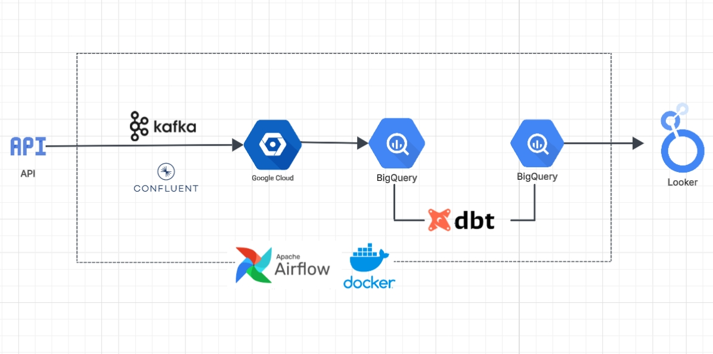
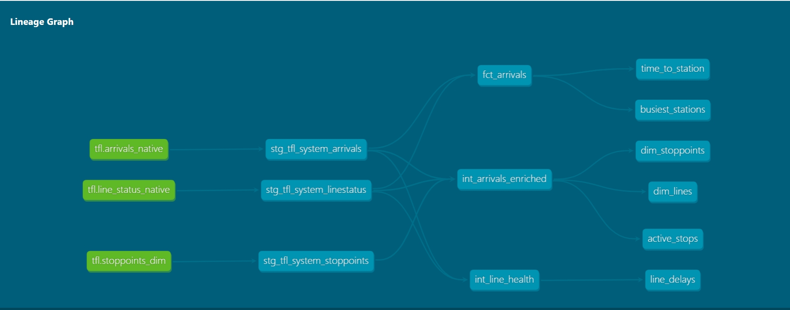
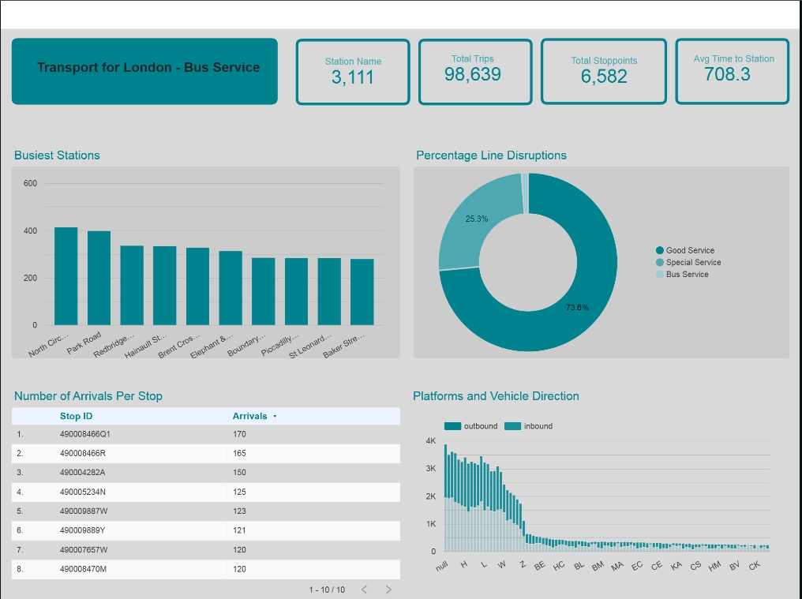

# TfL-Streaming-Service
About An end-to-end data engineering pipeline capturing real-time TfL (Transport for London) vehicle data. Features orchestration using Airflow, a streaming ingestion layer (Python/Kafka), Infrastructure as Code (Terraform), a GCP-based Data Lakehouse (GCS/BigQuery), and modular transformations with dbt
# Architecture Diagram

https://datastudio.google.com/reporting/380c05f4-f1ed-47a7-bf4f-8a4acb9924bc
